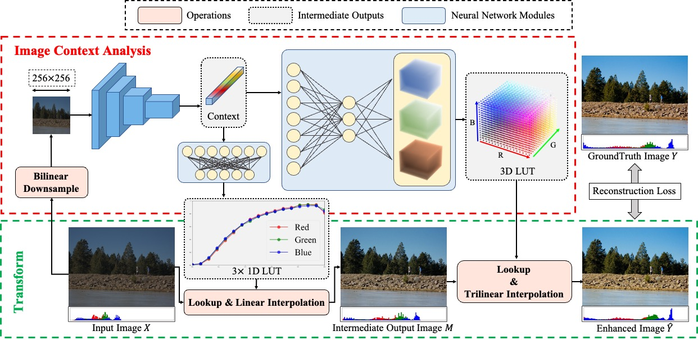

# SepLUT: Separable Image-adaptive Lookup Tables for Real-time Image Enhancement

## Introduction

The codebase provides the official PyTorch implementation and some model checkpoints for the paper ["SepLUT: Separable Image-adaptive Lookup Tables for Real-time Image Enhancement"](https://arxiv.org/abs/2207.08351) (accepted by ECCV 2022).

<p align="center">
  
</p>

In this project, we present a novel, general framework called SepLUT that simultaneously takes advantage of two different types of LUTs, both 1D and 3D, for realtime image enhancement. It separates a single color transform into component-independent and component-correlated sub-transforms in a cascade manner. Extensive experiments demonstrate that such a scheme helps sufficiently exert the capabilities of both types of LUTs and provides the proposed method with several promising properties, including enhanced expressiveness, high efficiency, and light memory/storage footprints.

The codebase is based on the popular MMEditing toolbox ([v0.11.0](https://github.com/open-mmlab/mmediting/tree/v0.11.0)). Please refer to [ori_README.md](https://github.com/open-mmlab/mmediting/blob/v0.11.0/README.md) for the original README.

## Code Structure

- `mmedit/`: the original MMEditing toolbox (without any modification).
- `seplut/`: the core implementation of the paper, including:
  - `annfiles/`: including the annotation files for FiveK and PPR10K datasets.
  - `dataset.py`: the dataset class for image enhancement (FiveK and PPR10K).
  - `transforms.py`: including some augmentations not provided by MMEditing toolbox.
  - `seplut_transform/`: including the python interfaces, the C++ CPU/CUDA implementation, and the wheel package of the cascade 1D and 3D LUT transform.
  - `modules/`: the implementation of the sub-modules in SepLUT, including backbone, LUT generators.
  - `model.py`: the implementation of SepLUT model.
  - `configs/`: including configurations to conduct experiments.
  - `metrics/`: including MATLAB scripts to calculate metrics reported in the paper.
  - `demo.py`: a python script to run a demo.
- `pretrained/`: including the pretrained models.

## Prerequisites

### Hardware

- CPU: Intel(R) Xeon(R) Platinum 8163 CPU @ 2.50GHz
- GPU: NVIDIA Tesla V100 SXM2 32G

### Dependencies

- Ubuntu 18.04.5 LTS
- Python 3.7.10
- PyTorch 1.8.1
- **GCC/G++ 7.5**
- **CUDA 10.2**
- **MMCV 1.6.0**
- **MMEditing 0.15.0**

### Installation

You can set up the MMEditing toolbox with conda and pip as follows:

```shell
conda install -c pytorch pytorch=1.8.1 torchvision=0.9.1 cudatoolkit=10.2 -y
pip install -r requirements.txt
pip install -v -e .
```

We provide a PyTorch extension (including both CPU and CUDA implementations) to speed up the cascade transformation of 1D and 3D LUTs. You can install the extension in either the following two ways:

- Compile and install the extension manually.

```shell
python seplut/seplut_transform/setup.py install
```

- Use the pre-compiled python wheel package.

```shell
pip install seplut/seplut_transform/seplut_ext-1.2.0-cp37-cp37m-linux_x86_64.whl
```

Note that the extension should be compiled and packaged using Python 3.7.10, PyTorch 1.8.1, GCC/G++ 7.5, and CUDA 10.2. If you fail to install the extension or encounter any issue afterward, please first carefully check your environment accordingly.

In case you would like to remove the installed extension, please execute the following command:

```shell
pip uninstall seplut_ext
```

## Demo

We provide a quick demo script in `seplut/demo.py`. You can execute it in the following way:
```shell
python seplut/demo.py [CONFIG_FILE] [MODEL_CHECKPOINT] [INPUT_IMAGE_PATH] [OUTPUT_IMAGE_PATH] \
  --cfg-options model.attr1=val1 model.attr2=val2 ... \
  --cfg-options test_cfg.en_quant=True --device -1      # [Optional] Enable quantization mode
```

For quick testing, we provide a pretrained model in `./pretrained/SepLUT-FiveK-sRGB-M8#3D17#1D17.pth` and an input image from the FiveK dataset in 8-bit sRGB format (`./resources/a4739.jpg`). You can conduct enhancement on it using the below command:
```shell
python seplut/demo.py seplut/configs/fivekrgb.py pretrained/SepLUT-FiveK-sRGB-M8#3D17#1D17.pth resources/a4739.jpg resources/a4739_enhanced.png
```
The enhanced result can be found in `resources/a4739_enhanced.png`.

## Datasets

The paper use the [FiveK](https://data.csail.mit.edu/graphics/fivek/) and [PPR10K](https://github.com/csjliang/PPR10K) datasets for experiments. It is recommended to refer to the dataset creators first using the above two urls.

### Download

- FiveK

You can download the original FiveK dataset from the dataset [homepage](https://data.csail.mit.edu/graphics/fivek/) and then preprocess the dataset using Adobe Lightroom following the instructions in [Prepare_FiveK.md](Prepare_FiveK.md).

For fast setting up, you can also download only the 480p dataset preprocessed by Zeng ([[GoogleDrive](https://drive.google.com/drive/folders/1Y1Rv3uGiJkP6CIrNTSKxPn1p-WFAc48a?usp=sharing)],[[onedrive](https://connectpolyu-my.sharepoint.com/:f:/g/personal/16901447r_connect_polyu_hk/EqNGuQUKZe9Cv3fPG08OmGEBbHMUXey2aU03E21dFZwJyg?e=QNCMMZ)],[[baiduyun](https://pan.baidu.com/s/1CsQRFsEPZCSjkT3Z1X_B1w):5fyk]), including 8-bit sRGB, 16-bit XYZ input images and 8-bit sRGB groundtruth images.

After downloading the dataset, please unzip the images into the `./data/FiveK` directory. Please also place the annotation files in `./seplut/annfiles/FiveK` to the same directory. The final directory structure is as follows.

```
./data/FiveK
    input/
        JPG/480p/                # 8-bit sRGB inputs
        PNG/480p_16bits_XYZ_WB/  # 16-bit XYZ inputs
    expertC/JPG/480p/            # 8-bit sRGB groundtruths
    train.txt
    test.txt
```

- PPR10K

We download the 360p dataset (`train_val_images_tif_360p` and `masks_360p`) from [PPR10K](https://github.com/csjliang/PPR10K) to conduct our experiments.

After downloading the dataset, please unzip the images into the `./data/PPR10K` directory. Please also place the annotation files in `./seplut/annfiles/PPR10K` to the same directory. The expected directory structure is as follows.

```
data/PPR10K
    source/       # 16-bit sRGB inputs
    source_aug_6/ # 16-bit sRGB inputs with 5 versions of augmented
    masks/        # human-region masks
    target_a/     # 8-bit sRGB groundtruths retouched by expert a
    target_b/     # 8-bit sRGB groundtruths retouched by expert b
    target_c/     # 8-bit sRGB groundtruths retouched by expert c
    train.txt
    train_aug.txt
    test.txt
```

## Usage

### General Instruction

- You can configure experiments by modifying the configuration files in `seplut/configs/`. Here we briefly describe some critical hyper-parameters:
  - `model.n_vertices_3d`: (int) The size of the 3D LUT (denoted as `S_t` in the paper).
  - `model.n_vertices_1d`: (int) The size of the 1D LUTs (denoted as `S_o` in the paper).
  - `model.n_base_feats`: (int) The channel multiplier in the backbone (denoted as `m` in the paper).

- Execute commands in the following format to train a model (all experiments can be conducted on a single GPU).
```shell
python tools/train.py [PATH/TO/CONFIG] --cfg-options model.attr1=val1 model.attr2=val2 ...
```

- Execute commands in the following format to run the inference given a pretrained model.
```shell
python tools/test.py [PATH/TO/CONFIG] [PATH/TO/MODEL/CHECKPOINT] --save-path [PATH/TO/SAVE/RESULTS] \
  --cfg-options model.attr1=val1 model.attr2=val2 ...
```

- Execute commands in the following format if you want to run inference on the quantized model.
```shell
CUDA_VISIBLE_DEVICES=-1 python tools/test.py [PATH/TO/CONFIG] [PATH/TO/MODEL/CHECKPOINT] \
  --save-path [PATH/TO/SAVE/RESULTS] \
  --cfg-options model.attr1=val1 model.attr2=val2 ... \
  --cfg-options test_cfg.en_quant=True
```

Note that the quantized model is only supported on CPU. Therefore we need to enable the CPU inference mode for MMEditing by specifying `CUDA_VISIBLE_DEVICES=-1`.

- Use MATLAB to calculate the metrics reported in the paper.
```shell
cd ./seplut/metrics
(matlab) >> fivek_calculate_metrics([PATH/TO/SAVE/RESULTS], [PATH/TO/GT/IMAGES])
```

### Training

- On FiveK-sRGB (for photo retouching)
```shell
# Ours-L (m=8, So=St=17)
python tools/train.py seplut/configs/fivekrgb.py --cfg-options model.n_base_feats=8 model.n_vertices_3d=17 model.n_vertices_1d=17
# Ours-S (m=6, So=St=9)
python tools/train.py seplut/configs/fivekrgb.py --cfg-options model.n_base_feats=6 model.n_vertices_3d=9 model.n_vertices_1d=9
```

- On FiveK-XYZ (for tone mapping)
```shell
# Ours-L (m=8, So=St=17)
python tools/train.py seplut/configs/fivekxyz.py --cfg-options model.n_base_feats=8 model.n_vertices_3d=17 model.n_vertices_1d=17
# Ours-S (m=6, So=St=9)
python tools/train.py seplut/configs/fivekxyz.py --cfg-options model.n_base_feats=6 model.n_vertices_3d=9 model.n_vertices_1d=9
```

- On PPR10K (for photo retouching)
```shell
# Ours-L (res18, So=St=17)
python tools/train.py seplut/configs/ppr10k.py --cfg-options model.n_vertices_3d=17 model.n_vertices_1d=17
# Ours-S (res18, So=St=9)
python tools/train.py seplut/configs/ppr10k.py --cfg-options model.n_vertices_3d=9 model.n_vertices_1d=9
```

### Testing

We provide some pretrained models in `./pretrained/`. To conduct testing, please use the following commands:

- On FiveK-sRGB (for photo retouching)
```shell
# Ours-L (m=8, So=St=17)
python tools/test.py seplut/configs/fivekrgb.py pretrained/SepLUT-FiveK-sRGB-M8#3D17#1D17.pth --cfg-options model.n_base_feats=8 model.n_vertices_3d=17 model.n_vertices_1d=17 --save-path [PATH/TO/SAVE/RESULTS]
# Ours-S (m=6, So=St=9)
python tools/test.py seplut/configs/fivekrgb.py pretrained/SepLUT-FiveK-sRGB-M6#3D9#1D9.pth --cfg-options model.n_base_feats=6 model.n_vertices_3d=9 model.n_vertices_1d=9 --save-path [PATH/TO/SAVE/RESULTS]
```

- On FiveK-XYZ (for tone mapping)
```shell
# Ours-L (m=8, So=St=17)
python tools/test.py seplut/configs/fivekxyz.py pretrained/SepLUT-FiveK-XYZ-M8#3D17#1D17.pth --cfg-options model.n_base_feats=8 model.n_vertices_3d=17 model.n_vertices_1d=17 --save-path [PATH/TO/SAVE/RESULTS]
# Ours-S (m=6, So=St=9)
python tools/test.py seplut/configs/fivekxyz.py pretrained/SepLUT-FiveK-XYZ-M6#3D9#1D9.pth --cfg-options model.n_base_feats=6 model.n_vertices_3d=9 model.n_vertices_1d=9 --save-path [PATH/TO/SAVE/RESULTS]
```

- On PPR10K (for photo retouching)
```shell
# Ours-L (res18, So=St=17)
python tools/test.py seplut/configs/ppr10k.py pretrained/SepLUT-PPR10KA-sRGB-Res18#3D17#1D17.pth --cfg-options model.n_vertices_3d=17 model.n_vertices_1d=17 --save-path [PATH/TO/SAVE/RESULTS]
# Ours-S (res18, So=St=9)
python tools/test.py seplut/configs/ppr10k.py pretrained/SepLUT-PPR10KA-sRGB-Res18#3D9#1D9.pth --cfg-options model.n_vertices_3d=9 model.n_vertices_1d=9 --save-path [PATH/TO/SAVE/RESULTS]
```
## License

This codebase is released under the [Apache 2.0 license](LICENSE).

## Citation

If you find this repository useful, please kindly consider citing the following paper:
```
@InProceedings{yang2022seplut,
  title={SepLUT: Separable Image-adaptive Lookup Tables for Real-time Image Enhancement},
  author={Yang, Canqian and Jin, Meiguang and Xu, Yi and Zhang, Rui and Chen, Ying and Liu, Huaida},
  booktitle={European Conference on Computer Vision (ECCV)},
  year={2022}
}
```

## Acknowledgements

This codebase is based on the following open-source projects. We thank their authors for making the source code publically available.

- [MMEditing](https://github.com/open-mmlab/mmediting)
- [TPAMI 3D-LUT](https://github.com/HuiZeng/Image-Adaptive-3DLUT)
- [PPR10K](https://github.com/csjliang/PPR10K)
